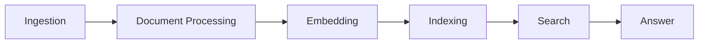

# RAG System for Document Processing and Question Answering

## 📚 Overview
This is a Retrieval-Augmented Generation (RAG) system that helps you:
- Process documents (PDFs, web pages)
- Search through them intelligently
- Get relevant answers to your questions

Think of it as your personal AI research assistant!

## 🎯 Key Features
- 📄 Document Processing: Handle PDFs and web content
- 🔍 Smart Search: Find relevant information quickly
- 🧠 AI-Powered: Uses embeddings to understand content
- 💾 Persistent Storage: Save and reload your processed documents
- ⚡ Multiple Search Methods: Regular and keyword-based search

## 🏗️ System Architecture
The system is organized into several key components:

1. **Ingestion**:
   - 📄 Document Processing: Convert raw text into Document objects
   - 🔍 Embedding: Convert text into numerical vectors
   - 💾 Indexing: Save and load searchable indexes



Each component has a specific role:
1. **Content Handler**: Gets text from PDFs and websites
2. **Document Processor**: Prepares documents for AI processing
3. **Embedding Manager**: Adds AI understanding to documents
4. **Index Manager**: Organizes documents for quick search
5. **Query Processor**: Handles your questions
6. **RAG Pipeline**: Coordinates the search process

## 🚀 Getting Started

### Prerequisites
Before you begin, ensure you have the following installed:
- Python 3.7 or higher
- pip (Python package manager)
- Internet access (for downloading models and dependencies)

### Installation
1. Clone the repository:
   ```bash
   git clone https://github.com/your_username/rag-project.git
   cd rag-project
   ```

2. Create a virtual environment (optional but recommended):
   ```bash
   python -m venv venv
   source venv/bin/activate  # On Windows use `venv\Scripts\activate`
   ```

3. Install the dependencies:
   ```bash
   pip install -r requirements.txt
   ```

### Usage
To run the main application, use the following command:
```bash
python main.py
```

### Workflow
The RAG system follows a workflow that includes:
1. **Document Store Initialization**: Creates or loads a persistent storage for documents.
2. **Document Processing**: Processes text to create vector representations.
3. **Indexing**: Indexes processed documents for efficient searching.
4. **Query Handling**: Allows for queries on indexed documents, returning relevant answers.

### Examples
You can modify the `main.py` file to include your own texts in the `raw_texts` list. The system will process these texts and generate an index that can be queried.

## 🧪 Testing
The RAG system includes a comprehensive suite of tests to ensure the functionality of its components. The following tests are available:

- **Unit Tests**: Verify individual components such as `DocumentProcessor`, `EmbeddingManager`, and `IndexManager`.
- **Integration Tests**: Validate the interaction between components and the overall workflow of the RAG system.

### Running Tests
To execute all tests, follow these steps:

1. Ensure you are in the project directory.
2. Run the tests using the following command:
   ```bash
   python -m unittest discover -s tests
   ```

This command will discover and run all test cases located in the `tests` directory.

### Running Individual Tests
To run a specific test, you can use the following command format:
```bash
python -m unittest tests.test_module.TestClass.test_method
```
Replace `test_module` with the name of the test file (without the `.py` extension), `TestClass` with the name of the test class, and `test_method` with the name of the specific test method you want to run. For example:
```bash
python -m unittest tests.test_document_processor.TestDocumentProcessor.test_create_documents
```


